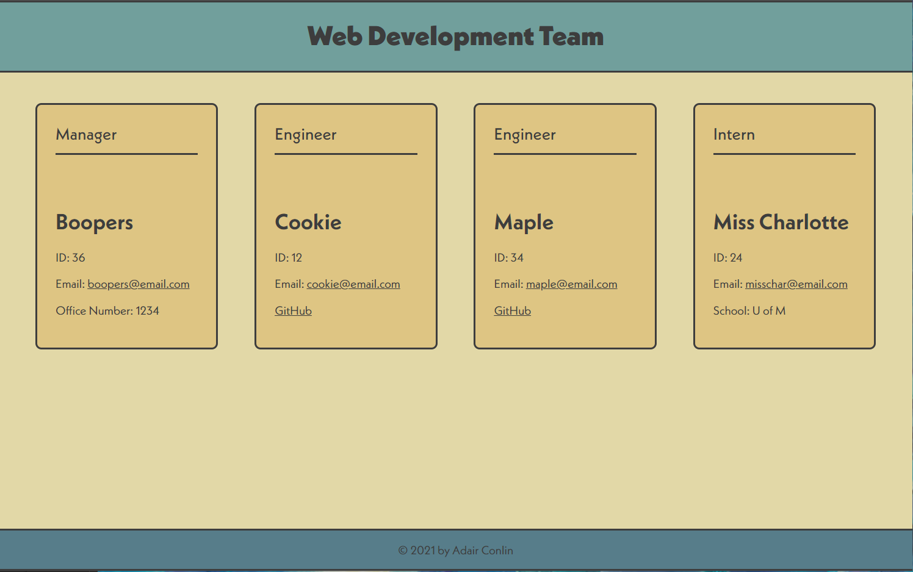

# Team Profile Generator

## Description
This application is a Node.js command-line application that allows users to organize and display their teams. Through the command line, generator takes in information from a user and includes layouts for a manager role, an engineer role, and an intern role. The user can have multiple of each roles. Once the user input is complete, the application generates an HTML webpage that display all of the users inputs in an organized fashion.

### Technology
Building this application required Jest in order to test functions and minimize the amount of written code, and Inquirer in order to prompt users from command line. 

## Usage
To set up this application yourself, simply clone this repository to your own machine and run the command `npm init` in the root directory of the project folder. Then, install Inquirer with the command `npm install inquirer`. 

To run this application, run the command `node index` and you will begin the prompts. After answering each prompt accordingly, you will be given a success message that indicates the index.html file has been created. Launch the newly created index.html file to see your team profile generated!

